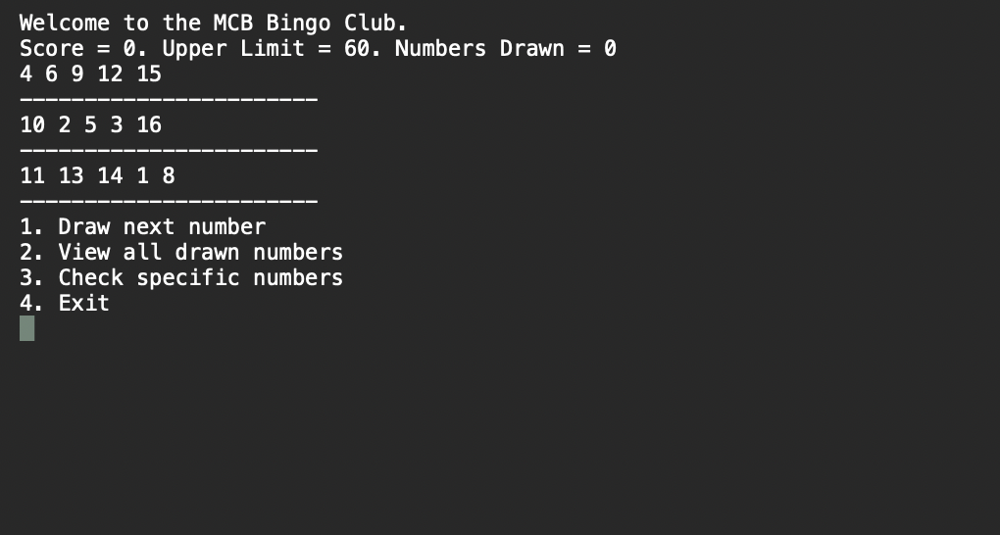
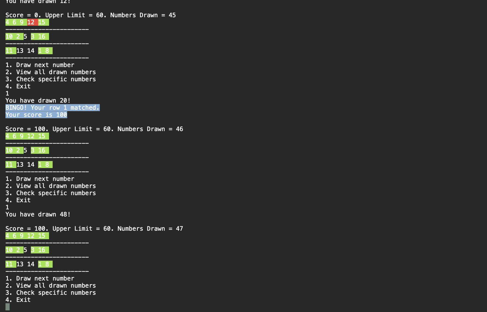

# MCD Bingo APP

MCD Bingo APP is created for MCB. This app is developed with C# and .NET6.

## Instructions to play the game

- Run the app in visual studio or other IDE
- The progam will generate a 5x3 bingo board for you.
- User will then find options to futher draw the ball or see the drawn balls till now.
- If the user choses to draw the ball, then a random number is generated between 1 and the upper value (in our case 60).
- If the drawn number is there in the Bingo card then the number will turn red pointing that the number matched.
- If the whole row is matched, the user will see a message saying the row#number mactched and increment the score accordingly.
- If the whole board matched is matched, then the user will see a message saying the YOU WON and increment the score accordingly.

## Screenshots

